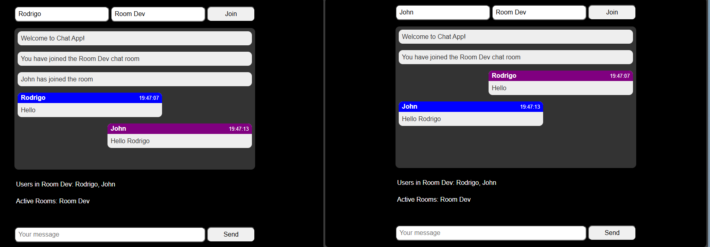

# Chat App Node JS

🚀This application is a chat, where users can chat in a specific room. It was developed with Node.js, Express, and Socket.io 

In the project directory, you can run:

### `npm start`

